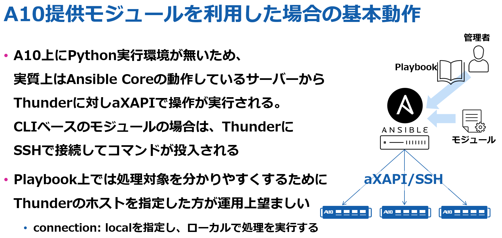
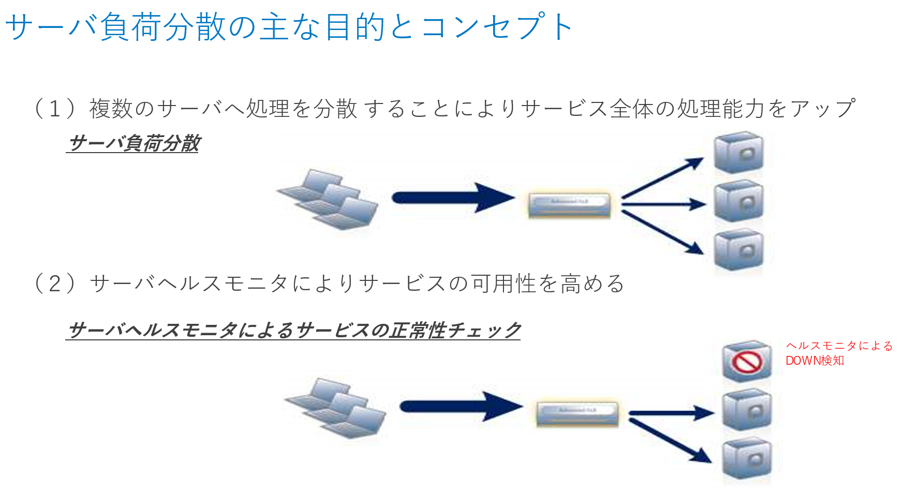
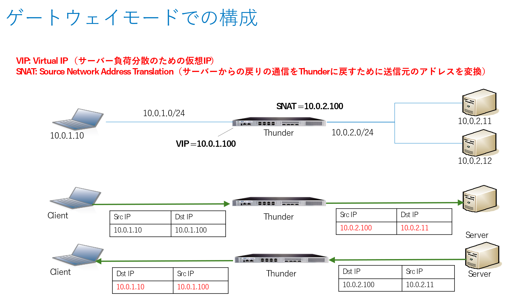
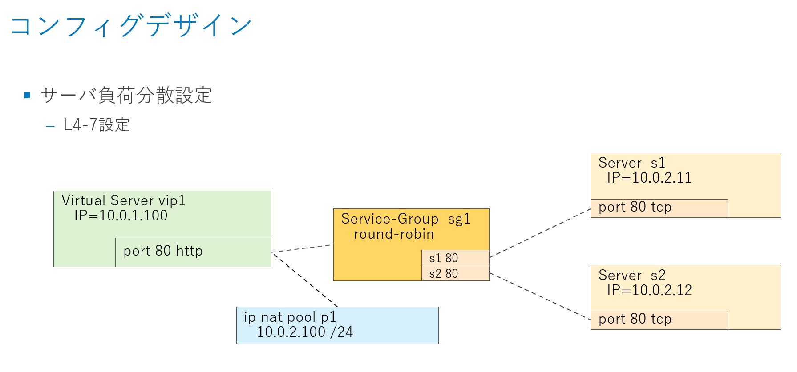
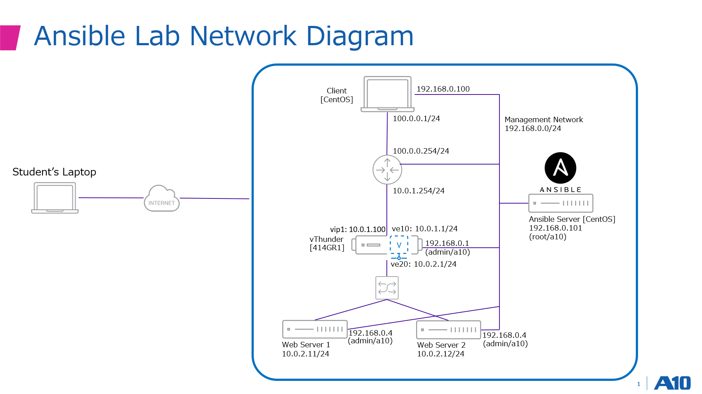

# 演習 1.0 - サーバ負荷分散の基礎と演習環境の確認

この演習では、ADCによる負荷分散の基礎について紹介し、演習で利用する環境の事前準備を実施します。

## 目次

- [Thunder用Ansibleモジュールについて](#Thunder用Ansibleモジュールについて)
- [サーバ負荷分散の基礎](#サーバ負荷分散の基礎)
- [演習環境について](#演習環境について)
- [Windows10へのリモートデスクトップ接続](#Windows10へのリモートデスクトップ接続)
- [vThunderの構成確認](#vThunderの構成確認)
- [Ansible実行サーバの環境確認と初期設定](#Ansible実行サーバの環境確認と初期設定)

# Thunder用Ansibleモジュールについて

A10 Thunder用のREST APIであるaXAPIを利用するAnsibleモジュールは、以下のGitHubにあります。
ほぼ全ての機能の構成管理に対応する1,600以上のモジュールが用意されています。

[Click here to A10 aXAPI Based Ansible Modules on GitHub](https://github.com/a10networks/a10-acos-axapi)

また、SSHを経由してCLIを実行する、他社のネットワーク製品を操作するものと同様のAnsibleモジュールがAnsible Galaxyに登録されています。

[Click here to A10 SSH Based Ansible Modules on GitHub](https://galaxy.ansible.com/a10/acos_cli)

これらのモジュールを利用可能にするための方法を記述したスタートアップガイドは以下にあります。本演習で利用する環境では、このガイドに基づいて環境が構築されています。

[Clieck here to A10 Ansible Modules Startup Guide](./202006_Ansible_Guide.pdf)

A10の提供するAnsibleモジュールではA10 Thunderの提供するREST APIであるaXAPI、またはSSHを経由したCLIコマンドを利用しています。
Ansibleモジュールを実行する際は、Ansible Coreが動作しているサーバにSSHし、ローカルでモジュールを実行することで、aXAPI/SSHを通じた構成変更が行われます。



このトレーニングではこのAnsibleモジュールの一部を利用して、A10 vThunderのサーバ負荷分散設定に関わる構成変更を行います。
Ansibleモジュールの実体は、Ansible用CentOSサーバの`/root/.ansible/collections/ansible_collections/a10`以下にあり、このディレクトリ以下で全てのモジュールを確認できます。

# サーバ負荷分散の基礎

ADC（Application Delivery Controller）のサーバー負荷分散の主な目的は、

- 複数のサーバーへ処理を分散することでサービス全体の処理性能をアップする
- サーバヘルスモニタによりサービスの可用性を高める

の2点になります。



ADCは主にネットワークスイッチよりも上位のレイヤ4（トランスポート層）からレイヤ7（アプリケーション層）で、セッションベースで動作します。

ADCは負荷分散するサービスに応じてさまざまな構成での導入が可能ですが、このトレーニングでは、ゲートウェイモードでの構成を行います。
この構成では、クライアントはA10 Thunder ADCの仮想IP（Virtual IP；VIP）にアクセスし、送信元IPが変換されてサーバーに転送されます。
負荷分散の方式に応じてThunder ADCが2台のサーバーにトラフィックを分散します。
ヘルスモニターの結果、もしサーバーが動作していなければ、トラフィックを転送しません。
サーバーは変換された送信元IPに対してレスポンスを返し、Thunderでトラフィックを受信します。
Thunderはレスポンストラフィックの宛先を元のクライアントのIPに変換し、送信元IPもVIPに変換してトラフィックを返送します。



この構成を行うために、Thunder ADCでは以下のような設定を行います。

まず負荷分散の対象となるサーバーのIPアドレスとポート番号（ここではHTTPの80番）を設定し、これを複数まとめてService Groupというものを構成します。
Service Groupの中で負荷分散の方式を設定します（ここでは到着順にトラフィックを割り振るRound Robin方式を採用しています）。
クライアントからのトラフィックを受信するVirtual ServerとIPアドレス、および受信ポートを設定し、受信ポートにService Groupを紐づけます。
また、別途SNAT用のIPアドレスプールの設定を行い、これも受信ポートに設定を紐づけます。

こうすることで、Virtual ServerのIPアドレスの80番ポートに来たHTTPトラフィックは、SNATされてサーバーに負荷分散されます。
構成のデザインを図示したものが以下になります。




# 演習環境について



本演習での演習環境は上記のようになっています。

Windows 10のクライアントが1台、仮想版のThunderであるvThunderを1台、サーバー負荷分散の対象となるWebサーバー（CentOSサーバ）を2台用意しています。
上記に加え、Ansibleの実行用にCentOSのサーバーを1台用意しています。

Windows 10クライアントにはRemote Desktopで、Ansible実行用のCentOSサーバーにはSSH経由で外部からのアクセスが可能です。
その他の機器には、Windows 10クライアントまたはAnsible実行用サーバーから上図中に示されている管理用のIPアドレスにアクセスすることで、管理用ポートからのログインが可能です。

データ通信用のネットワークは2つのセグメントに分かれています。
vThunderのethernet 1は10.0.1.0/24のネットワークセグメントに接続されており、vThunderのethernet 2とWebサーバーは10.0.2.0/24のネットワークセグメントに接続されています。

本演習では、簡単のために全ての操作をroot/admin権限で実施します。

# Windows10へのリモートデスクトップ接続

まず、演習環境のWindows 10クライアントへリモートデスクトップ接続します。
リモートデスクトップ接続用に利用するドメイン名またはIPアドレスについては、演習担当から別途通知されますのでそちらをご利用ください。

# vThunderの構成確認

リモートデスクトップでWindows 10クライアントにログインできたら、Teratermなどを使ってvThunderにログインします。
vThunderの管理用IPアドレスにSSHで接続し、ユーザ名とパスワードを入力してログインします。

ThunderのCLIには、Execモード、Enableモード、Configモードの3種類のモードがあります。


CLIにログイン後、以下のように`enable`コマンドを実行するとEnableモードになります。Passwordは設定されていません。
Enableモードに入ると、プロンプトが`#`に変わります。

ここで`show running-config`コマンドを実行すると、現在の設定を確認できます。
最初の段階では、主に管理ポート用の設定だけが入っていることがわかります。
```
vThunder> enable
Password:
vThunder# show running-config
!Current configuration: 251 bytes
!Configuration last updated at 15:15:52 IST Wed Sep 11 2019
!Configuration last saved at 15:16:31 IST Wed Sep 11 2019
!64-bit Advanced Core OS (ACOS) version 4.1.4-GR1, build 78 (Jan-18-2019,16:02)
!
multi-config enable
!
terminal idle-timeout 0
!
interface management
  ip address 10.255.0.1 255.255.0.0
  ip default-gateway 10.255.255.1
!
interface ethernet 1
!
interface ethernet 2
!
!
sflow setting local-collection
!
sflow collector ip 127.0.0.1 6343
!
!
end
!Current config commit point for partition 0 is 0 & config mode is classical-mode
vThunder#
```

EnableモードからExecモードに戻る場合や、Thunderからログオフする際は、`exit`コマンドを実行します。
```
vThunder# exit
vThunder> exit
```


# Ansible実行サーバの環境確認と初期設定

Windows 10クライアントから、またはインターネット経由でAnsible実行サーバにSSHでrootとしてログインします。
ログインすると、以下のディレクトリがあることを確認できます（以下のもの以外のファイルやディレクトリはそのままにしておいてください）。
- example_certs: 応用演習に関するTLS証明書と秘密鍵のサンプルが格納されています
- example_playbook: 本演習に関するAnsible Playbookのサンプルが格納されています

`example_certs`や`example_playbook`の内容は、このトレーニングのGitHubにも格納されています。

[Clieck here to example_certs directory](../example_certs/)

[Clieck here to example_playbook directory](../example_playbook/)

Ansibleのバージョンや、環境変数の確認を以下のように実施してください。
```
[root@ansible ~]# ansible --version
ansible 2.9.9
  config file = /etc/ansible/ansible.cfg
  configured module search path = [u'/root/.ansible/plugins/modules', u'/usr/share/ansible/plugins/modules']
  ansible python module location = /usr/lib/python2.7/site-packages/ansible
  executable location = /usr/bin/ansible
  python version = 2.7.5 (default, Apr  2 2020, 13:16:51) [GCC 4.8.5 20150623 (Red Hat 4.8.5-39)]
[root@ansible ~]# echo $ANSIBLE_CLICONF_PLUGINS
/root/.ansible/collections/ansible_collections/a10/acos_cli/plugins/cliconf
[root@ansible ~]# echo $ANSIBLE_TERMINAL_PLUGINS
/root/.ansible/collections/ansible_collections/a10/acos_cli/plugins/terminal
[root@ansible ~]# echo $ANSIBLE_ACTION_PLUGINS
/root/.ansible/collections/ansible_collections/a10/acos_axapi/plugins/action
```

Ansible実行サーバ上で実習用のplaybookを格納するディレクトリを作成し、そのディレクトリに移動します。
```
[root@ansible ~]# mkdir playbook
[root@ansible ~]# cd playbook
```

ディレクトリ内にAnsibleのインベントリを示すためのファイル`hosts`を作成します。
```
[root@ansible playbook]# vi hosts
```

`hosts_axapi`に以下の内容を記述し保存します。
```
[vThunder]
192.168.0.1

[vThunder:vars]
ansible_username=admin
ansible_password=a10
ansible_port=443
```

`[vThunder:vars]`にPlaybook全般で利用する以下の変数を記述しています。
- ansible_username: vThunderのaXAPIにアクセスするためのユーザー名
- ansible_password: vThunderのaXAPIにアクセスするためのパスワード
- ansible_port: vThunderのaXAPIにアクセスするポート番号

`[vThunder]`にはPlaybookで操作対象にするThunder（本演習では1台のみ）のIPアドレスを記述しています。

これで、AnsibleでvThunderのADC設定を行う準備ができました。

本演習は以上となります。  [トレーニングガイドに戻る](../README.ja.md)
