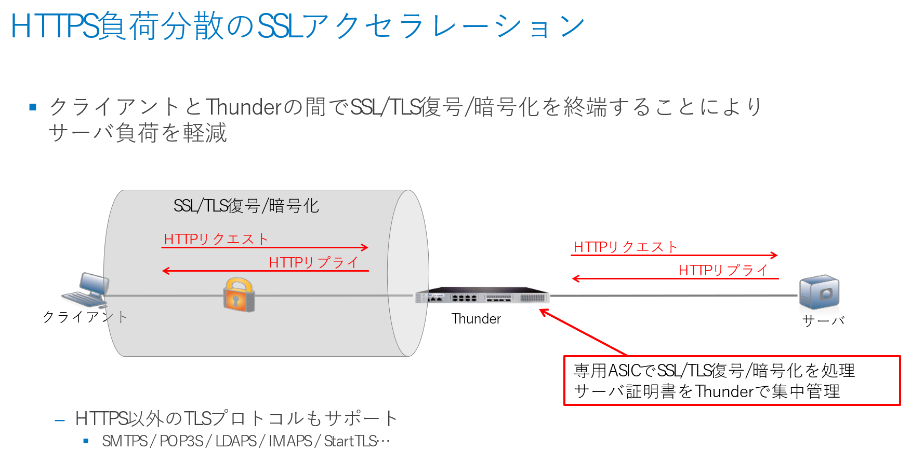
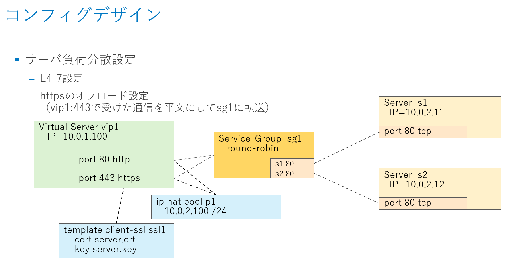

# 演習 2.0 - 自己証明書の作成とThunderへのインポート

## 目次

- [本演習の目的](#本演習の目的)
- [自己証明書の作成](#自己証明書の作成)
- [証明書をインポートするPlaybookの作成](#証明書をインポートするPlaybookの作成)
- [証明書をインポートするPlaybookの実行](#証明書をインポートするPlaybookの実行)

# 本演習の目的

応用演習では、基本演習で実施したHTTPのサーバー負荷分散に加え、vThunderでのSSL/TLSオフロードの構成を実現します。
この構成では、vThunderはVirtual-ServerでHTTPS通信を終端し、平文にしたのちにHTTP通信をWebサーバーに転送します。
処理の負荷が高いSSL/TLSの処理をvThunderが実施することで、Webサーバーの負荷を軽減できます。
また、HTTPのWebサーバーの前段にvThunderを配置することでWebサービスのHTTPS化を実現できます。



vThnderでHTTPS通信を終端するためには、vThunder上にサーバー証明書と秘密鍵を配置する必要があります。
構成のデザインを図示すると以下のようになります。



本演習ではまず、WebサーバーのHTTPS化のために自己証明書を生成し、`a10_import`モジュールを利用して、生成された自己証明書と秘密鍵をvThunderにインポートします。
ここではインポートには（例として）SFTPプロトコルを用います。

# 自己証明書の作成

Ansible実行用サーバーの/root/ディレクトリ以下にcertsという名前のディレクトリを新たに作成します。
opensslを使い、certsディレクトリ内で自己証明書や秘密鍵を生成します。
server.csrの作成時にはCountry NameとCommon Nameが必須になるので、以下の例のように適当な値を入力ください。
その他は空欄で構いません。

```
[root@ansible ~]# mkdir certs
[root@ansible ~]# cd certs
[root@ansible certs]# openssl genrsa 2048 > server.key
[root@ansible certs]# openssl req -new -key server.key > server.csr
You are about to be asked to enter information that will be incorporated
into your certificate request.
What you are about to enter is what is called a Distinguished Name or a DN.
There are quite a few fields but you can leave some blank
For some fields there will be a default value,
If you enter '.', the field will be left blank.
-----
Country Name (2 letter code) [XX]:JP
State or Province Name (full name) []:
Locality Name (eg, city) [Default City]:
Organization Name (eg, company) [Default Company Ltd]:
Organizational Unit Name (eg, section) []:
Common Name (eg, your name or your server's hostname) []:www.example.com
Email Address []:

Please enter the following 'extra' attributes
to be sent with your certificate request
A challenge password []:
An optional company name []:
[root@ansible certs]# openssl x509 -req -days 3650 -signkey server.key < server.csr > server.crt
```

これで、Ansible実行用サーバーの/root/certs以下にserver.crt、server.keyが配置されます。

# 証明書をインポートするPlaybookの作成

証明書と鍵をインポートするために、Ansible実行用サーバーのplaybookディレクトリで、`a10_import_cert_and_key.yaml`という名前でPlaybookを作成します。
このPlaybookでは、Ansibleモジュールとして`a10_import`を利用します。

```
[root@ansible playbook]# vi a10_import_cert_and_key.yaml
```

vThunderからAnsible実行用サーバーにSFTPでアクセスし、証明書と鍵のファイルをインポートする設定をPlaybookに記述します。

``` 
---
- hosts: 192.168.0.1
  connection: local
  gather_facts: no
  collections:
    - a10.acos_axapi

  vars:
    ansible_host: "192.168.0.1"
  tasks:
  - name: Import cert file
    a10_import:
      ansible_host: "{{ ansible_host }}"
      ansible_port: "{{ ansible_port }}"
      ansible_username: "{{ ansible_username }}"
      ansible_password: "{{ ansible_password }}"
      ssl_cert: "server.crt"
      use_mgmt_port: True
      overwrite: True
      remote_file: "sftp://root@192.168.0.101/root/certs/server.crt"
      password: "a10"
      state: present

  - name: Import key
    a10_import:
      ansible_host: "{{ ansible_host }}"
      ansible_port: "{{ ansible_port }}"
      ansible_username: "{{ ansible_username }}"
      ansible_password: "{{ ansible_password }}"
      ssl_key: "server.key"
      use_mgmt_port: True
      overwrite: True
      remote_file: "sftp://root@192.168.0.101/root/certs/server.key"
      password: "a10"
      state: present
```

- `ssl_cert: "server.crt"`は、モジュールのパラメーターで、`a10_import`で証明書をインポートする時の、Thunder上でのファイル名を指定します。
- `ssl_key: "server.key"`は、モジュールのパラメーターで、`a10_import`で秘密鍵をインポートする時の、Thunder上でのファイル名を指定します。
- `use_mgmt_port: True"`は、モジュールのパラメーターで、`a10_import`でファイルをインポートする時に管理ポート経由で行うことを指定しています。
- `overwrite: True"`は、モジュールのパラメーターで、`a10_import`でファイルをインポートする時に同一名のファイルがすでにThunder上にあった場合は上書きすることを指定しています。
- `remote_file: "sftp://root@192.168.0.101/root/certs/server.crt"`は、モジュールのパラメーターで、`a10_import`でファイルをインポートする時にThunderがファイルを取りに行く場所を指定しています。
- `password: "a10"`は、モジュールのパラメーターで、`a10_import`でファイルをインポートする時にThunderがファイルを取りに行く場所にアクセスするためのパスワードを指定しています。

ここまで記述したところで、Playbookを保存しコマンドラインに戻ります。

# 証明書をインポートするPlaybookの実行

このPlaybookを実行すると、以下のようになります。
(注：このPlaybookが動作するにはvThunder上にAnsibleサーバーの公開鍵が保存されている必要があります。もし動作しない場合はvThunderから一度AnsibleサーバーにSSHでログインしてください）

```
[root@ansible playbook]# ansible-playbook -i hosts a10_import_cert_and_key.yaml

PLAY [192.168.0.1] ********************************************************************************************************************************

TASK [Import cert file] ***************************************************************************************************************************
 [WARNING]: Module did not set no_log for password

 [WARNING]: Module did not set no_log for pfx_password

changed: [192.168.0.1]

TASK [Import key] *********************************************************************************************************************************
changed: [192.168.0.1]

PLAY RECAP ****************************************************************************************************************************************
192.168.0.1                : ok=2    changed=2    unreachable=0    failed=0    skipped=0    rescued=0    ignored=0

```

2つのタスクが実行され、証明書と秘密鍵がインポートされます。

vThunder上で`show pki cert`を実行することで、インポートされたファイルを確認できます。

```
vThunder#show pki cert
Name: server.crt  Type: certificate  Expiration: Sep  8 13:12:30 2029 GMT [Unexpired, Unbound]
Name: server.key  Type: key  [Unbound]
```

これで、自己証明書を利用したHTTPSサーバの設定の準備ができました。
次の演習では、Virtual-ServerでSSL/TLSを終端するためのSSL/TLSテンプレートを作成します。

本演習は以上となります。  [トレーニングガイドに戻る](../README.ja.md)
